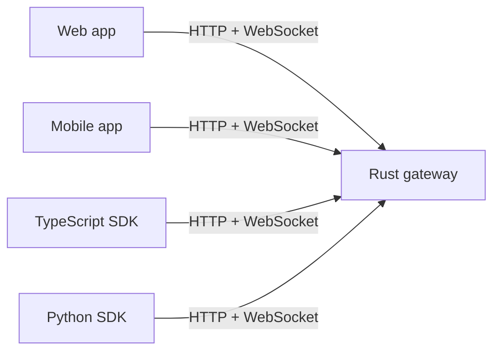

# Wisdoverse Nexus

**Source-available, Rust-first infrastructure for real-time collaboration and AI-assisted workflows.**

[](https://github.com/Wisdoverse/Wisdoverse-Nexus/actions/workflows/ci.yml)
[](rust-toolchain.toml)
[](package.json)
[](LICENSE)
[](docs/en/guides/m1-acceptance.md)

[简体中文](README.zh-CN.md) · [Documentation](https://wisdoverse.github.io/Wisdoverse-Nexus/)

> [!WARNING]
> **Pre-1.0 engineering preview.** The supported M1 gateway profile runs in one process, serves one tenant, and stores rooms and messages in memory. A restart clears that state. Use it for development, evaluation, and other permitted non-production work.

## ✨ Components

- 🚪 **Rust gateway:** HTTP and WebSocket APIs, HS256 JWT validation, health checks, OpenAPI, and Prometheus metrics.
- 🧩 **Rust workspace:** shared protocol types and domain crates for collaboration and AI integration.
- 🖥️ **Clients:** React web and Expo mobile applications for rooms and messaging.
- 📦 **SDKs:** TypeScript and Python clients.
- 🛠️ **Operations:** Docker Compose, Helm, and monitoring assets for development and evaluation.

The gateway validates HS256 JWTs issued by your application.

### Client connections



## 🚀 Quick start

### Requirements

Install Rust with `rustup`. The repository selects Rust 1.99.0 through [`rust-toolchain.toml`](rust-toolchain.toml). The source quick start does not require Node.js or Docker.

### Run the gateway

```bash
git clone https://github.com/Wisdoverse/Wisdoverse-Nexus.git
cd Wisdoverse-Nexus
cargo run --locked -p nexis-gateway
```

In another terminal, check the health endpoint:

```bash
curl -fsS http://localhost:8080/health
```

The gateway returns `OK` when it is ready. It also serves OpenAPI at `/openapi.json`, Swagger UI at `/docs`, and metrics at `/metrics`.

The gateway creates a random, process-local secret when development runs without `JWT_SECRET`. Configure the same `JWT_SECRET` as your issuer to validate its tokens. Production mode (`NEXIS_ENV=production`) requires a nonblank `JWT_SECRET` before startup.

### Run with Docker Compose

Use Docker Compose v2 to start the local stack and wait for its health check:

```bash
docker compose up -d --wait
curl -fsS http://localhost:8080/health
```

Stop the stack after you finish:

```bash
docker compose down
```

## 🗺️ Repository map

| Area | Path | Scope |
| --- | --- | --- |
| Gateway | [`crates/nexis-gateway`](crates/nexis-gateway/) | HTTP and WebSocket server |
| Rust crates | [`crates/`](crates/) · [`Cargo.toml`](Cargo.toml) | Workspace protocol and domain modules; see the roadmap for acceptance status |
| Web client | [`apps/web`](apps/web/) | React application |
| Mobile client | [`apps/mobile`](apps/mobile/) | Expo application |
| TypeScript SDK | [`sdk/typescript`](sdk/typescript/) | Gateway client library |
| Python SDK | [`sdk/python`](sdk/python/) | Gateway client library |
| Operations | [`deploy/`](deploy/) · [`ops/`](ops/) | Compose, Helm, and monitoring assets |

## 🧭 Explore

- 🚀 [Quick start](docs/en/getting-started/quick-start.md)
- 🧰 [Development guide](docs/en/getting-started/development-guide.md)
- 🔌 [API reference](docs/en/api/reference.md)
- 🟦 [TypeScript SDK guide](sdk/typescript/README.md)
- 🐍 [Python SDK guide](sdk/python/README.md)
- 🏛️ [Architecture overview](docs/en/architecture.md)
- ✅ [M1 scope and acceptance evidence](docs/en/guides/m1-acceptance.md)
- 🛣️ [Roadmap](docs/en/roadmap.md) · [Roadmap execution standard](docs/en/guides/roadmap-execution.md)
- 🤝 [Contributing](CONTRIBUTING.md)
- 🔐 [Security policy](SECURITY.md)
- 📝 [Project specification](SPEC.md) — project requirements and agent handoff context.

## 📄 License

Wisdoverse Nexus uses the **Wisdoverse Nexus Business Source License 1.1 (BSL 1.1)**. Before each version's change date, the license permits personal learning, research, education, development and testing, internal evaluation, and non-production use.

Commercial production use, SaaS, hosted or managed services, resale, sublicensing, and commercial redistribution require separate written authorization.
Building, operating, or materially supporting a competing product or service also requires separate written authorization. Each version changes to Apache License 2.0 four years after Wisdoverse first makes it public. Read [LICENSE](LICENSE) for the full terms.
