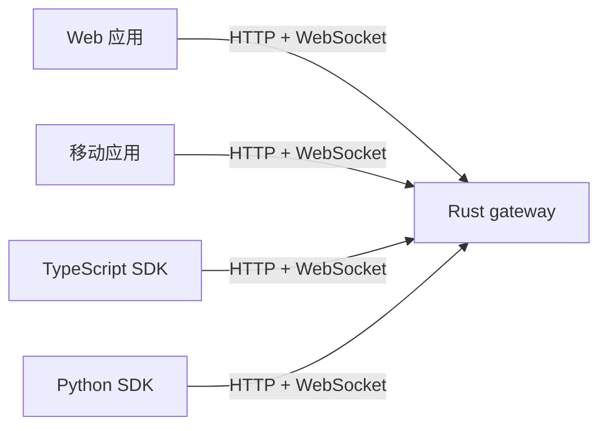

# Wisdoverse Nexus

**源码可用、Rust 优先的协作基础设施，支持实时协作和 AI 辅助工作流。**

[](https://github.com/Wisdoverse/Wisdoverse-Nexus/actions/workflows/ci.yml)
[](rust-toolchain.toml)
[](package.json)
[](LICENSE)
[](docs/en/guides/m1-acceptance.md)

[English](README.md) · [项目文档](https://wisdoverse.github.io/Wisdoverse-Nexus/)

> [!WARNING]
> **Pre-1.0 工程预览版。** 当前支持的 M1 gateway 配置为单进程、单租户，房间和消息保存在内存中。进程重启后，这些状态会丢失。请将其用于开发、评估和许可证允许的其他非生产用途。

## ✨ 项目组件

- 🚪 **Rust gateway：**提供 HTTP 和 WebSocket API、HS256 JWT 验证、健康检查、OpenAPI 和 Prometheus metrics。
- 🧩 **Rust workspace：**提供协作和 AI 集成所需的共享协议类型与领域 crate。
- 🖥️ **客户端：**React Web 应用和 Expo 移动应用，支持房间与消息协作。
- 📦 **SDK：**TypeScript 和 Python 客户端。
- 🛠️ **运维资源：**提供 Docker Compose、Helm 和监控资源，用于开发和评估。

Gateway 验证由你的应用签发的 HS256 JWT。

### 客户端连接



## 🚀 快速开始

### 环境要求

使用 `rustup` 安装 Rust。仓库通过 [`rust-toolchain.toml`](rust-toolchain.toml) 选择 Rust 1.99.0。源码 quick start 不需要 Node.js 或 Docker。

### 运行 gateway

```bash
git clone https://github.com/Wisdoverse/Wisdoverse-Nexus.git
cd Wisdoverse-Nexus
cargo run --locked -p nexis-gateway
```

在另一个终端检查健康接口：

```bash
curl -fsS http://localhost:8080/health
```

Gateway 就绪时会返回 `OK`。它还在 `/openapi.json` 提供 OpenAPI 文档，在 `/docs` 提供 Swagger UI，在 `/metrics` 提供 metrics。

开发环境未设置 `JWT_SECRET` 时，gateway 会生成仅供当前进程使用的随机密钥。若要验证签发方的 token，请配置与签发方相同的 `JWT_SECRET`。生产模式（`NEXIS_ENV=production`）要求启动前配置非空的 `JWT_SECRET`。

### 使用 Docker Compose

使用 Docker Compose v2 启动本地容器栈，并等待健康检查通过：

```bash
docker compose up -d --wait
curl -fsS http://localhost:8080/health
```

完成验证后，再停止容器栈：

```bash
docker compose down
```

## 🗺️ 仓库结构

| 区域 | 路径 | 范围 |
| --- | --- | --- |
| Gateway | [`crates/nexis-gateway`](crates/nexis-gateway/) | HTTP 和 WebSocket 服务 |
| Rust crate | [`crates/`](crates/) · [`Cargo.toml`](Cargo.toml) | workspace 协议和领域模块；验收状态见路线图 |
| Web 客户端 | [`apps/web`](apps/web/) | React 应用 |
| 移动客户端 | [`apps/mobile`](apps/mobile/) | Expo 应用 |
| TypeScript SDK | [`sdk/typescript`](sdk/typescript/) | Gateway 客户端库 |
| Python SDK | [`sdk/python`](sdk/python/) | Gateway 客户端库 |
| 运维资源 | [`deploy/`](deploy/) · [`ops/`](ops/) | Compose、Helm 和监控资源 |

## 🧭 项目导航

- 🚀 [快速开始](docs/zh-CN/getting-started/quick-start.md)
- 🧰 [开发指南](docs/zh-CN/getting-started/development-guide.md)
- 🔌 [API 参考](docs/en/api/reference.md)
- 🟦 [TypeScript SDK 指南](sdk/typescript/README.md)
- 🐍 [Python SDK 指南](sdk/python/README.md)
- 🏛️ [架构概览](docs/zh-CN/architecture/index.md)
- ✅ [M1 范围和验收证据](docs/en/guides/m1-acceptance.md)
- 🛣️ [路线图](docs/zh-CN/roadmap.md) · [路线图执行标准](docs/zh-CN/guides/roadmap-execution.md)
- 🤝 [参与贡献](CONTRIBUTING.md)
- 🔐 [安全策略](SECURITY.md)
- 📝 [项目规格说明](SPEC.md) — 记录项目需求和 agent 协作上下文。

## 📄 许可证

Wisdoverse Nexus 使用 **Wisdoverse Nexus Business Source License 1.1（BSL 1.1）**。在每个版本的变更日期之前，该许可证允许个人学习、研究、教育、开发和测试、内部评估及非生产用途。

商业生产环境使用、SaaS 或托管服务、managed service、转售、再授权及商业再分发，需要单独的书面商业授权。
构建、运营或实质支持竞争产品或服务，也需要单独的书面商业授权。Wisdoverse 首次公开某个版本四年后，该版本自动转换为 Apache License 2.0。完整条款请见 [LICENSE](LICENSE)。
